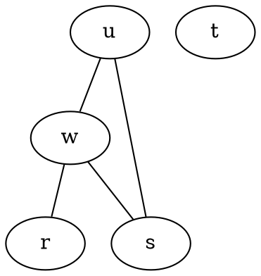

# learn-AI - Artificial Intelligence Projects

## 1. The Maximum Clique Problem ##
A program that computes the size of the maximum clique in a graph. Clique is a fully connected subgraph, the probelm of finding the maximum clique is NP-complete, i.e. there exists no polynomial time algorithm for solving it. A simple Brute-Force approach is employed to find all the subgraphs in the graph. A program needs to be able to read an undirected graph from a file. The file format it should recognize is a simplifed version of the dot format.
Here's an example:

## 2. The Huarong Pass Puzzle ##
A program that uses uninformed search to solve the Huarong Pass Puzzle. It is a sliding block puzzle where the tiles are initially arranged as shown in the picture below. The objective is to move the top center piece, representing the Chinese general
Cao Cao to the opening at the bottom. 

Different search strategies like BFS, DFS, BID(Bidirectional search) are studied and the performance of these strategies are compared on the problem. Search strategies from [AIMA](http://aima.cs.berkeley.edu/) are used for implementation purposes.
