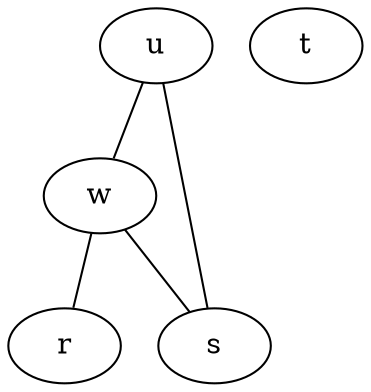

# learn-AI - Artificial Intelligence Projects

## 1. The Maximum Clique Problem ##
A program that computes the size of the maximum clique in a graph. Clique is a fully connected subgraph, the probelm of finding the maximum clique is NP-complete, i.e. there exists no polynomial time algorithm for solving it. A simple Brute-Force approach is employed to find all the subgraphs in the graph. A program  needs  to  be  able  to  read  an  undirected  graph from  a file. The file  format  it  should  recognize  is  a  simpli ed  version  of  the dot format.
Here's an example:

